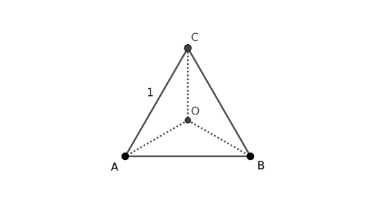

#### Title

定义平面上点集 $S$ 的 *直径* 为集合内任意两点的距离的上确界. 现将边长为 $1$ 的正三角形 $\triangle ABC$ 任意划分成三个区域，记为 $S_1$ , $S_2$ , $S_3$ ， 试证：必定存在一个直径不小于 $\frac{1}{\sqrt 3}$ 的区域.

<!-- more -->

#### *Proof*

如图所示，取正三角形 $\triangle ABC$ 的中心 $O$，显见 $OA=OB=OC=\frac{1}{\sqrt 3}$. 在点集 $\{O, A, B, C\}$ 中，任意两点的距离不小于 $\frac{1}{\sqrt 3}$ . 并由抽屉原理可知，必定有两个点属于同一个区域，根据点集直径的定义，该区域的直径不小于 $\frac{1}{\sqrt 3}$.

Q.E.D

