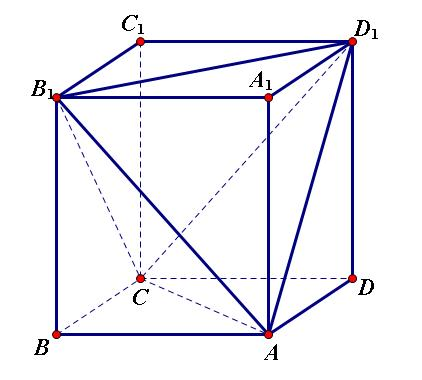

#### Title

考虑一个正方体，对其每个顶点都赋上一个非负实数，并令其顶点上的实数之和恰等于 $1$。现有甲乙二人在此正方体上进行一场游戏，第一轮由甲选取正方体的一个面，第二轮由乙选一个与上一轮所选平面垂直的面，第三轮再由甲选取一个与前两轮所选平面都垂直的面，试证：甲总有办法使得最后所选的三个面所相交的正方体顶点上的实数不大于 $\frac16$.

<!-- more -->

#### *Proof*

不妨将所赋值不大于 $\frac16$ 的顶点称为 “良好点” ，并称这类点是 “良好的” 或具有 “良好性“.

注意到，要使得最后的三个面的相交顶点满足 “良好性”，则只需令第一轮选择的面所表示的正方形中，至少一条对角线上的两个点是良好点即可. 下面就来证明总存在这样的面.

易知，良好点至少有三个，否则，非良好点至少有 $8-2=6$ 个，那么所有顶点的赋值之和就会大于 $1$，与题设矛盾. 

同时，一个正方体的八个顶点可以构造两个不相交的正四面体. 如下图所示，$AB_1D_1C$ 和 $A_1BC_1D$ 是两个正四面体，它们的每一条棱都恰好是正方体某个面的对角线：

而总共至少三个良好点，由抽屉原理可知，必然有两个良好点分布在同一个正四面体中，这两个点所在的面就是所要证存在的面. 从而命题得证. 

Q.E.D.

#### Note

正四面体的论证过程是由本问题的原答案提供的，非常简洁漂亮；笔者在做本题时原来的思路是固定一个良好点，结合抽屉原理对另外两个点进行讨论，思路本质上一致，只是稍显繁琐. 

