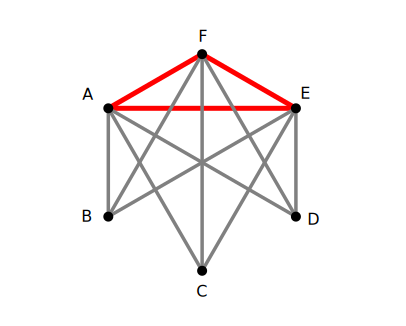
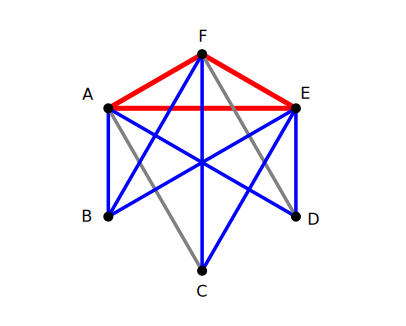
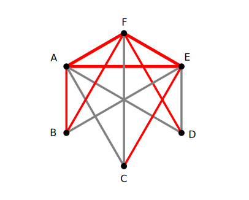
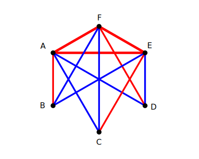

#### Title

对一个六阶完全图 $K_6$ 的每条边染上红蓝两色. 试证：可以找到两个 $K_3$，其中每一个 $K_3$ 的各条边同色.

<!-- more -->

#### *Proof*

显然，我们在 $K_6$ 中可以很容易地找到一个各边同色的 $K_3$ ，现在我们来证明存在不止一个这样的 $K_3$.

不失其一般性，我们假设已经找到了一个红色的 $K_3$，并且为了方便显示，我们假设其三个顶点都排布在 $K_6$ 的上部——这些假设不会对本证明的正确性产生任何实质影响.

于是我们看到，$A$ , $E$ , $F$ 是已知的红色 $K_3$ 的三个顶点，我们称之为 “**首点**”；而剩下的 $B$ , $C$ , $D$ 三个点，我们称之为 “**尾点**”. 

尾点与首点之间恰好连结起 $3 \times 3 =9$ 条边，不妨称之为 “**横跨边**”. 在上图中，它们显示为灰色，我们接下来将对它们的颜色进行讨论.

##### Case 1 存在多于 $6$ 条蓝色横跨边

即至少存在 $7$ 条蓝色横跨边，而注意到首点恰有三个，由抽屉原理可知，至少存在一个首点，从该点射出三条蓝色横跨边：

如上图所示，点  $E$ 就是射出三条蓝色横跨边的点. 此时考虑三个尾点之间的三条边，它们或者全都为红色，或者至少有一条为蓝色，但无论如何，我们都将得到一个新的同色 $K_3$.

##### Case 2 存在多于 $3$ 条红色横跨边

与 Case 1 类似，我们注意到至少有 $4$ 条红色横跨边，而尾点恰有三个，因此由抽屉原理可知，至少存在一尾点，从该点射出两条红色横跨边：

如上图所示，点  $B$ 就是射出两条红色横跨边的点. 此时，它与 $A$ , $F$ 两个首点直接构成了一个红色的 $K_3$.

##### Case 3 恰存在 $3$ 条红色横跨边和 $6$ 条蓝色横跨边

在此基础上，我们进一步把约束缩窄，使得横跨边的染色满足：

1. 每个首点都恰好射出一条红边，且每个尾点都恰好接收一条红边，从而每条红边的首（尾）点都互不相交；
2. 每个首点都恰好射出两条蓝边，且每个尾点都恰好接收两条蓝边

如若不然，则本情形将退化为前两个情形之一. 而满足以上约束的染色如下图：

我们可以看到，尾点集内部的三条边 $BC$ , $CD$ , $DB$ 要么都染成红色，要么至少有一条边是蓝色；而由抽屉原理可知，无论怎样，我们都将得到一个新的同色 $K_3$.

综合 Case 1, 2, 3 可知，命题得证.

Q.E.D.

