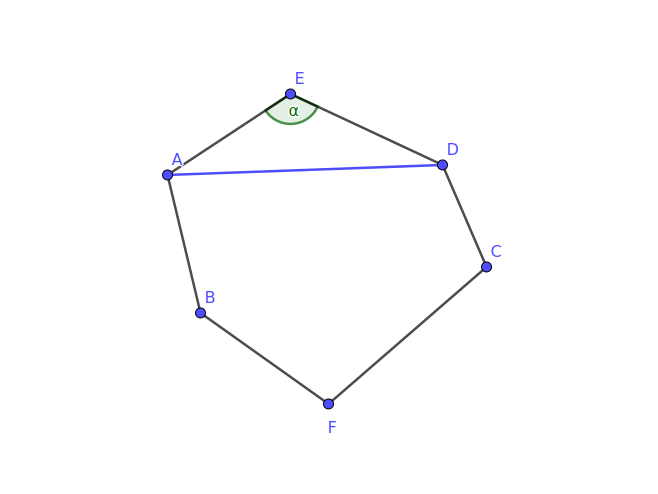
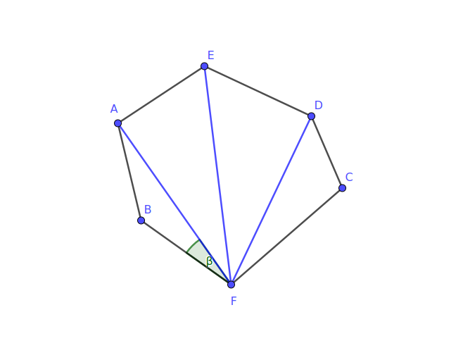
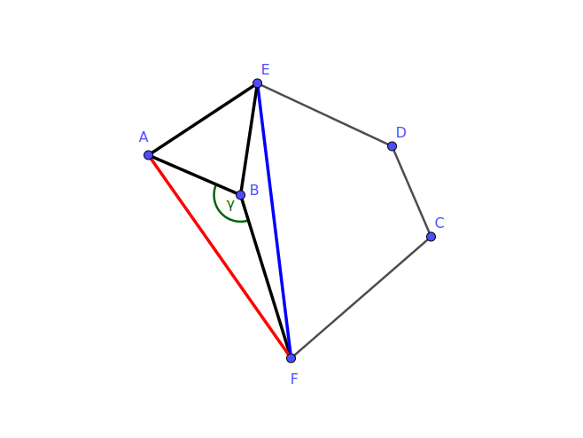
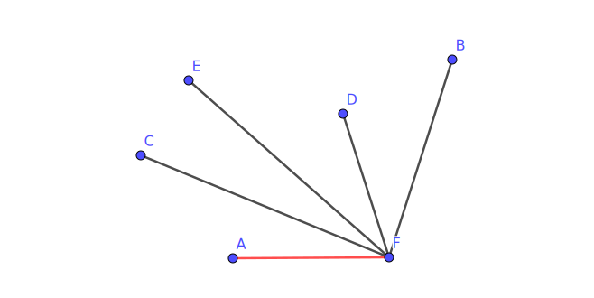

#### Title
平面上有六个点，其中任意三点都不共线，试证：存在这样的三个点，它们连线所构成的三角形中有一个角不大于 $30^{\circ}$

<!-- more -->
#### Solution
##### My Version
考虑平面上这六个点的集合的凸包——我们知道它必定存在且唯一——并进行讨论：

1. 若凸包是六边形

    这个六边形的内角和是 $180^{^{\circ}} \times (6-4)=720^{\circ}$，那么由抽屉原理可知，此六边形必定存在一个角不小于 $120^{\circ}$，如下图所示

    

    此时考虑此内角与其两条角边构成的三角形，由抽屉原理可知，这个三角形中已经有了一个不小于 $120^{\circ}$ 的角，因此另外必存在一个不大于 $30^{\circ}$ 的角.

    当然也可以换一种说明方式：凸包六边形中必存在一个不大于 $120^{\circ}$ 的角，以这个角的顶点为基准，可以将六边形分割成 $4$ 个三角形，如下图所示：

    

    于是这四个三角形中必有一个具有不大于 $30^{\circ}$ 的角.

2. 若凸包不是六边形
  
    则这个凸包至少是凸三角形，至多是凸五边形，并且无论如何都有至少一个点位于凸包的内部（不含边界），我们把这些点称之为 “内点”，如图所示

    

    并且注意到凸包可以划分为若干个三角形，那么位于凸包的内点也必定位于某个划分而得的三角形内（注意不含边界，否则与任意三点不共线的题设矛盾）

    于是，由抽屉原理可知，以该内点为顶点的三个角中，必有一个不小于 $120^{\circ}$ ,而该角所在的三角形的另外两个内角必然至少有一个不超过 $30^{\circ}$.

综上，命题得证.

Q.E.D.

##### Solution by textbook
这六个点中必然有两个这样的点，其他的四个点都位于它们的连线的同一侧，如图所示

我们考虑所有以 $AF$ 为边，且以点 $F$ 为顶点的角中的最大者 $\angle AFB$

1. 如果 $\angle AFB > 120^{\circ}$，则 $\angle ABF$ 或者 $\angle FAB$ 中必有一个小于 $30^{\circ}$；

2. 如果 $\angle AFB \leq 120^{\circ}$，则 $\angle AFC$, $\angle CFE$, $\angle EFD$, $\angle DFB$ 中至少有一个不超过 $30^{\circ}$.

综上可知，命题成立.

Q.E.D.
