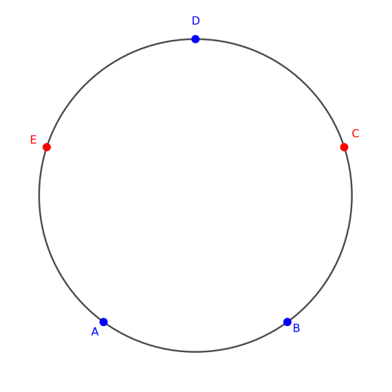
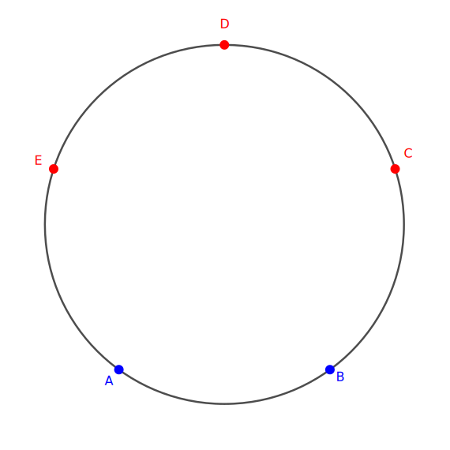
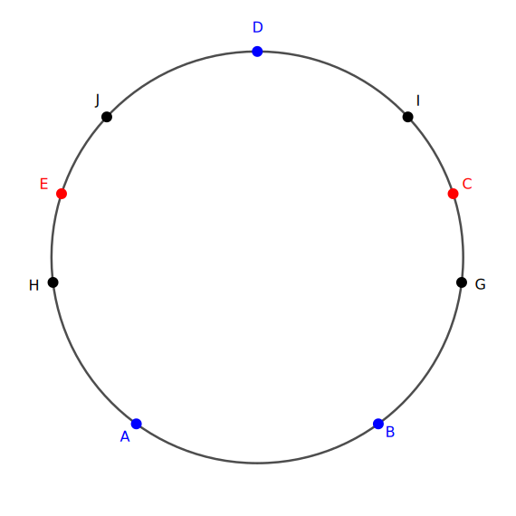
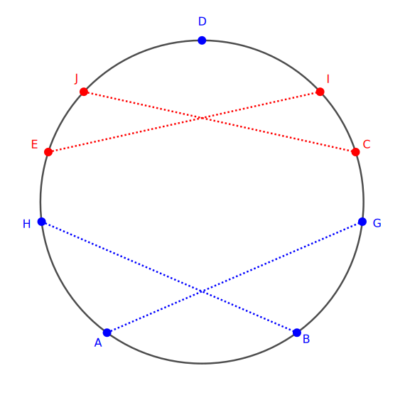
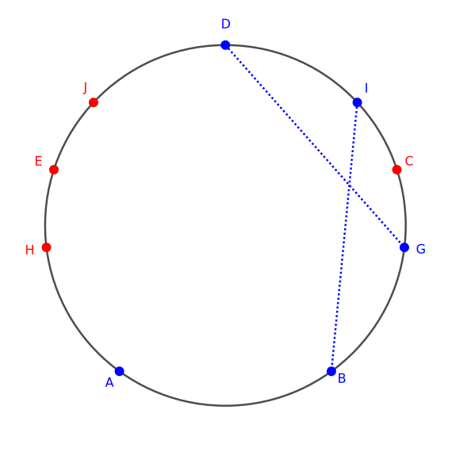
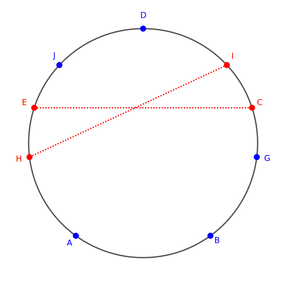
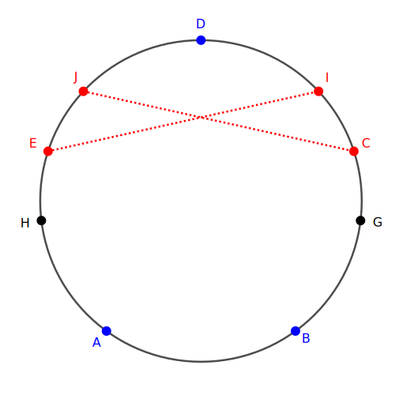
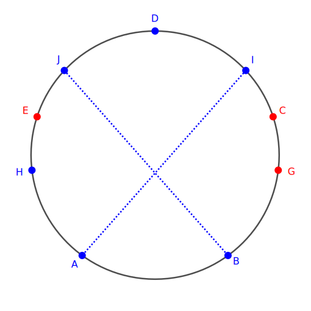

#### Title

对圆周上每个点都涂上蓝、红两种颜色中之一. 试证：存在一个内接梯形，其四个顶点具有相同的颜色.

<!-- more -->

#### *Proof*

首先需要注意到以下事实：

> **引理1：圆周上两条长度相同的弦，若其端点不重合，则这两条弦的四个端点构成一个等腰梯形.** 

在圆周上取其内接正五边形，记为 $ABCDE$ . 由于这五个顶点被染成红蓝两种颜色，由抽屉原理可知，存在至少三个点，它们的颜色相同。不妨称数量更多的同色顶点成为 “众点”，它们所染的颜色称为 “众色”.

针对众点的数量分类讨论：

1. 若存在 $4$ 个众点：则这四个点直接使欲证命题成立；

2. 若恰存在 $3$ 个众点：

    则 $ABCDE$ 五个点的染色情况只能是如下两种之一：

    

    ————如上图所示：存在孤立众点

    

    ————如上图所示：连续3个众点

然而,这两种染色情况对于证明本题是完全等价的，不失其一般性，我们对第一种染色进行讨论. 

为方便起见，记图1中 $CE$ 为 “奇异边”，与奇异边平行的 $AB$ 为 “正边”，$AD$ , $BD$ 为 “侧边” . 在圆周上作点 $G$ , $H$ , $I$ , $J$ 使得弦 $HE=JE=GC=IC$. 同样地， $G$ , $H$ , $I$ , $J$ 中每个点都将被染成红蓝两色中一种. 如图所示：

再对 $G$ , $H$ , $I$ , $J$ 四个点的染色进行分类讨论：

1. $G$ , $H$ , $I$ , $J$ 四个点染成 $2$ 蓝 $2$ 红：  

    分别考虑蓝点和红点各自的排布方向，继续细分讨论：

    - 与奇异边平行  
    

    如图所示，结合引理可知，我们同时得到了红色和蓝色的等腰梯形，于是欲证命题成立.

    - 与侧边平行  
    

    这种情形下，由于$DC=CB$ 且 $IC=CG$ ，因而 $DI=GB$ ，结合引理可知， $G$ , $H$ , $I$ , $J$ 中被染成众色的两个点与侧边的两个端点构成等腰梯形，欲证命题成立.

    - 相互交叉  
    
    
    这种情形下，由于$EH=IC$ ，由引理可知，$G$ , $H$ , $I$ , $J$ 中没有被染成众色的两个点与奇异边的两个端点构成等腰梯形，欲证命题成立.

2.  $G$ , $H$ , $I$ , $J$ 四个点中存在多于两个同色点：

    由抽屉原理可知，或者 $H$, $G$ 同色，或者 $I$, $J$ 同色，即总存在一条与奇异边和正边平行的弦，其两个端点同色；

    进而，这两个同色的端点要么被染成众色，从而与正边的两个端点构成等腰梯形；要么没有被染成众色，从而与奇异边的两个端点构成等腰梯形。
    
    

    

综上所述，命题所述的（等腰）梯形恒存在，因此命题得证.

Q.E.D
