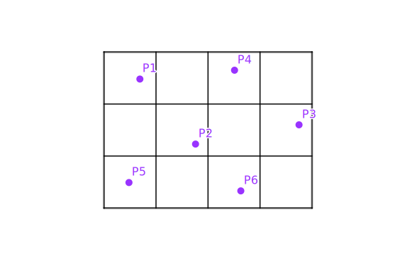
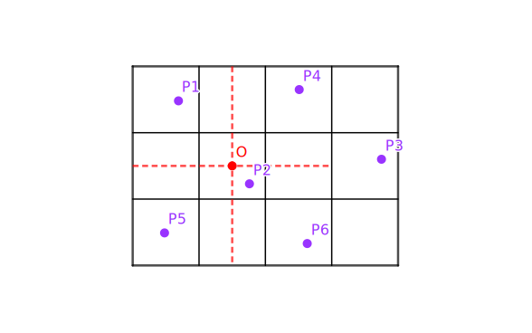
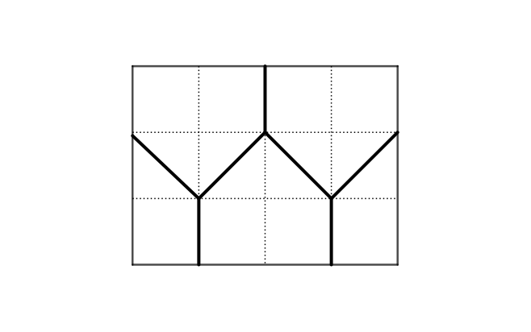

#### Title

在一个 $3 \times 4$ 的矩形中放置 $6$ 个点. 试证：存在两个点，它们的距离不大于 $\sqrt{5}$ .

<!-- more -->

#### *Proof*

这里提供两种解决方法.

##### Version 1

注意到一个 $2\times 1$ 的矩形的对角线是 $\sqrt{5}$，而一个矩形中任意两点的最大距离是其对角线长度. 不妨按照单位长度将题设中矩形划分为 $12$ 个格子，当两个点位于相同或相邻格子时（含边界），则这两个点间的距离显然不大于 $\sqrt{5}$ .

排除以上显然的分布情形，这 $6$ 个点可能使得待证命题不成立的分布情况只有一种，如下图所示：

我们来看 点 $P_2$ 所处的格子，记其中心为 点 $O$ ，该点可以把左边的九个格子划分成 $4$ 个红边正方形，每个正方形的对角线长度为 $\sqrt{(1.5)^2+(1.5)^2}=\sqrt{4.5} < \sqrt{5}$，而由抽屉原理可知，点 $P_2$ 一定会与 $P_1$ , $P_4$ , $P_5$ , $P_6$ 这四个点中之一分布在同一个红边正方形中，从而它们的距离不大于 $\sqrt{5}$.

于是，无论如何，都不可能将这六个点以某种方式放置在 $3 \times 4$ 的矩形中并使每一对点的距离都大于 $\sqrt{5}$ ，证毕.

Q.E.D.

##### Version 2

将原矩形划分成如下 $5$ 部分，由抽屉原理直接得到结论：

Q.E.D.

#### Note

第一种解法是笔者的思路；第二种是网友的思路，极为简洁优美，参考地址如下：

[证明：如果在边长分别为3和4的矩形中有任意6个点，那么一定可以选出两个点，它们之间的距离不大于5](https://zhidao.baidu.com/question/752763632936925844.html)

笔者还曾尝试过使用另一种思路：计算各自以前面五个点为圆心，半径为 $\sqrt{5}$ 的圆的覆盖面积的下界——如果覆盖面积的下界比矩形的面积还**大**，那么第六个点一定与前面的某个点一齐使命题成立；而计算覆盖面积下界就是假设这些圆落在原矩形中面积尽可能小，且互相相交的部分尽可能大，但是这种思路不好做，因为如果按照最保守地放缩 “向下” 估计，最后会得到一个负数；如果放缩不够严格，又难以确定是否已经到达下界.