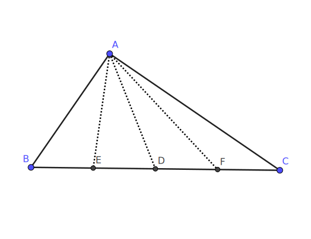
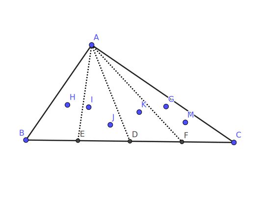
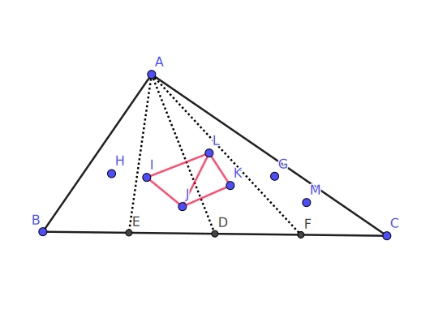
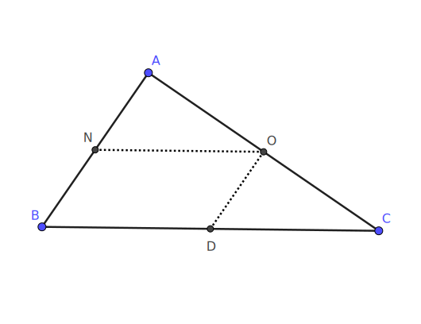

#### Title

在一个面积为 $1$ 的三角形内随意放置 $7$ 个点，并使得这 $7$ 个点中任意 $3$ 点都不在一条直线上，试证：在这 $7$ 个点中，存在三个点，使得它们构成的三角形面积不大于 $\frac{1}{4}$.

<!-- more -->

#### *Proof*

##### 1. My Version

任选三角形的一条边将其四等分，分别将这条边上的三个四等点与第三顶点相连，将原来的三角形四等分成四个面积都为 $\frac{1}{4}$ 的小三角形，如下图所示：

考虑这七个点的分布情形：

1. 若有三个点分布在同一个小三角形中（含边界）

    则这三点组成的三角形面积显然不大于 $\frac14$ ，于是命题成立.  

    

2. 不存在三个点分布在同一个小三角形中（含边界）

    则必定恰存在三个小三角形，它们中的每一个内部都恰有两个点，如下图所示：

    

    因为这样的小三角形有三个，因此它们之中必定有两个相邻，从而我们考虑这两个**相邻**的，内部各恰有两个点的小三角形**拼成的**面积为 $\frac12$ 的 “中三角形”——它们的内部有四个点，从而构成一个四边形，记其面积为 $S_0$ .

    这个四边形总可以划分成 $2$ 个三角形，记面积更小的那个面积为 $S_1$ .

    于是我们有 
    $$
    S_1 \leq \frac12 S_0,\ S_0 \leq \frac12 \Rightarrow S_1 \leq \frac14
    $$
    于是，命题也成立.

综合可知，命题得证.

Q.E.D.

##### 2. Solution by the author

取三边的中点，将原三角形分划为两个与原三角形相似，相似比为 $1 \mathbin{:} 2$ 的小三角形和一个面积为$\frac12$ 的平行四边形.

于是必定有三个点落在同一个区域中，这三个点构成的三角形面积不超过$\frac14$.

#### Note

本问题的参考答案好像有点语焉不详，为什么三个点落在平行四边形中面积也不会超过 $\frac14$ 呢？