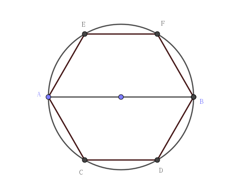

#### Title
将平面二染色，试证：存在两个相似三角形，它们的相似比为 $1:1995$，并且每个三角形的三个顶点各自都是同色的。

#### *Proof*

在平面上任选一点，记为 $O$, 以点 $O$ 为圆心作两个同心圆，其半径之比为 $1:1995$；

从 $O$ 点出发，作 $9$ 条射线，分别与小圆和大圆相交于不同的九个点；

因为平面被二染色，由抽屉原理可知，与小圆相交的 $9$ 个点中，必定有 $5$ 个点是同一种颜色的，不妨记这五个点为 $A$, $B$, $C$, $D$, $E$;

再继续考虑这五个点所在的射线：$OA$, $OB$, $OC$, $OD$, $OE$, 它们将继续交大圆于点 $A'$, $B'$, $C'$, $D'$, $E'$, 再次由抽屉原理可知，这五个点中有三个颜色相同，不失其一般性，我们不妨设这三点为 $A'$, $B'$, $C'$.

于是 $\triangle ABC$ 和 $\triangle A'B'C'$ 相似，相似比即为两个同心圆的半径比 $1:1995$

命题得证。

Q.E.D.

#### *Another version of proof*

首先，我们构造一个边长为 $2a$ 的正三角形，其中必定有一条边的两个端点被染成同样的颜色，不妨记为 $A$, $B$.

以 $AB$ 为直径构造一个圆，并在圆周上顺延 $A$, $B$ 两点进行六等分，得到 $A$, $B$, $C$, $D$, $E$, $F$，如下图所示：

不失一般性，我们假定 $A$, $B$ 两个点被染成黑色。

若其余的四个点中有一个是黑色点，那么我们立即就得到一个各边比例为 $1a:\sqrt{3}a:2a$ 的直角三角形，其三个顶点都同色。

若其余的四个点中全是白色点，那么我们也得到一个各边比例为 $1a:\sqrt{3}a:2a$ 的直角三角形，其三个顶点都为白色。

注意，$a$ 是变量，我们令 $a=1$ 以及 $a=1995$ 就能得到两个顶点各自同色，且相似比为 $1:1995$ 的三角形，从而命题得证。

Q.E.D.

