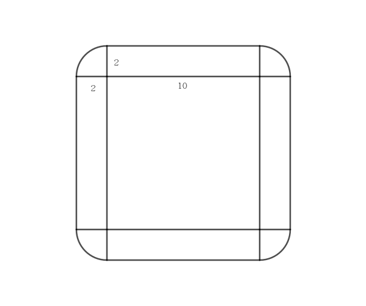

#### Title
在平面上有一个边长为 $10$ 的正方形，现有 $62$ 个半径为 $1$ 的圆覆盖在平面上，且每个圆与正方形都有交点，试证：其中必有两个圆相交。

#### *Proof*

由题设可知，圆的理论覆盖范围如下图所示：

假设所有圆之间都不相交，那么这些圆的总面积是 $62 \times \pi > 100 + 20 \times 4 + 4\pi$，产生矛盾。

Q.E.D.

