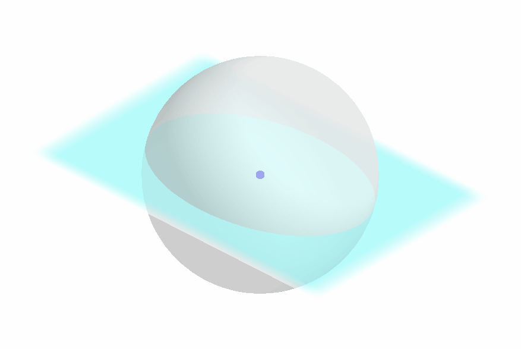
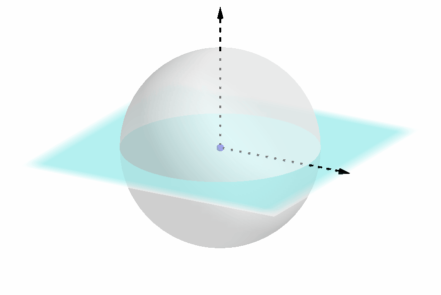
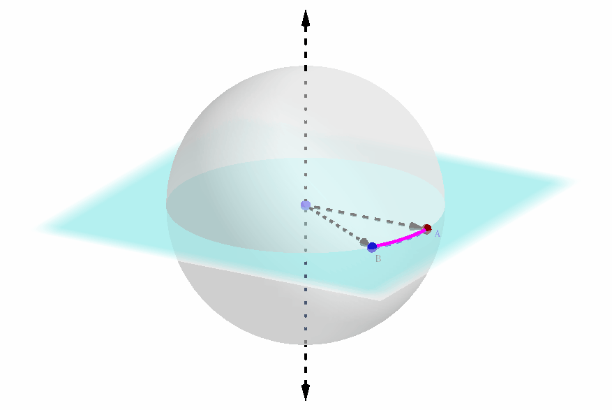
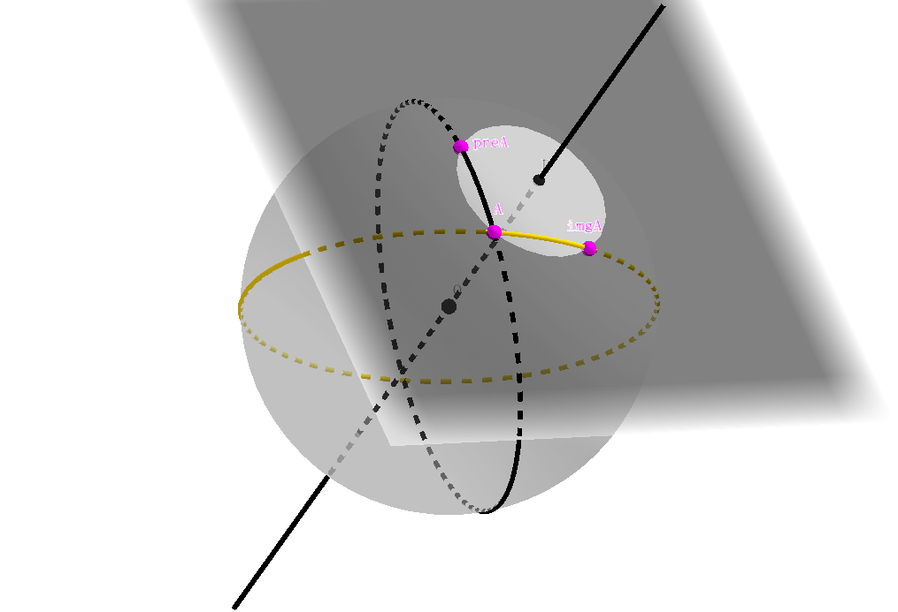
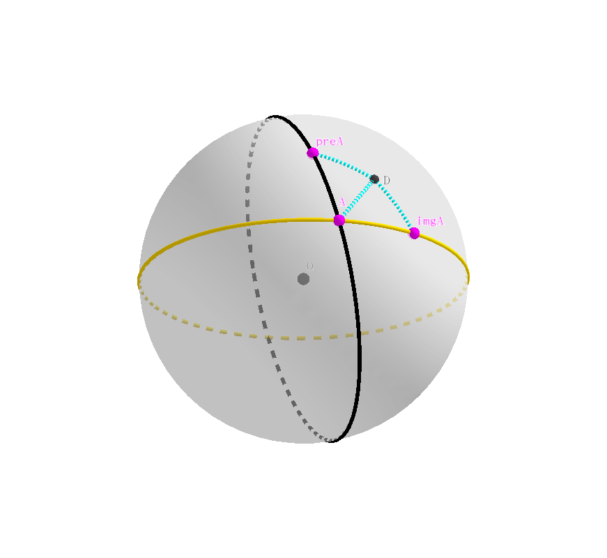

### 前言
- **本文中有较多动态图片，请耐心等待加载。**

- 阅读本文需要极少的球面几何常识。

### 定理表述
欧拉旋转定理 (Euler's Rotation Theorem)
:    在三维空间中，假设一个刚体在进行位移的时候，其上有一点保持不动，那么此位移等价于一次围绕着某个固定轴的旋转变换，且其旋转轴所在直线经过前述的不动点。

### 论证

#### 球坐标
在对三维空间或者二维空间中的对象进行几何变换时，我们一般会考虑对该对象的物体坐标系的变换效果，从而无数种不同的几何对象在这种变换之下的空间位置变化都具有统一的表达形式。

如图所示，由于几何对象的具体构造是无穷无尽的，我们其实只需考虑**附着在对象之上并与之其同步运动**的物体坐标系的几何变换，而几何对象在其物体坐标系中的表示是不变的，这样一切几何变换的效果就反映为对某个（物体）坐标系的变换效果。

本定理的证明需要用到球坐标。球坐标和经典的欧几里德坐标本质上并没有什么不同，而且很容易进行转换。

在我们的文章中，一个球坐标可以表示如下：
- 一个过单位球心的圆截面；
- 截面上一个单位向量；
- 正交于该截面的单位向量（极轴）；

它们三者共同构成一个球坐标，如下图所示：

#### 球坐标参数
需要说明的是，我们需要知道哪些参数（或者说多少个自由度）以确定一个球坐标？

1. 如下图所示，如果一个两个球坐标的截平面不同（暂时**不**考虑该平面的**正反**），那么这两个球坐标必定是相异的；

    

2. 如下图所示，如果两个球坐标的截平面重合，但是 “正反” 不一样，那么这两个球坐标也是相异的；注意到，**截平面的正反性其实就是极轴方向的正负性**；

    

3. 如下图所示，如果两个球坐标的圆截面和极轴都重合，仍需要确定圆截面上的坐标轴的具体方向；
    
    

由此可知，我们需要三个自由度以唯一地确定一个球坐标；事实上，在三维空间中，**确定一个几何体的位姿就恰好需要三个自由度**。

当然，我们还有另外的等价的表示方法。以下两方面信息也可以唯一地确定一个球坐标：

- 圆截面的位置

- 给定相应的圆心角的前提下，圆截面上某一段其两端点相互可区分的弧

其实也不难理解其原因：

1. 圆截面的位置和第一种表示相同，略；

2. 这段弧所指向的方向，本质上等同于提供了第一种方法中圆截面上的坐标轴的具体方向，如下图所示：
    
    

3. 此外，这段弧的两个端点是可以区分的，它们的排布是顺时针还是逆时针这一点实际上传达的信息是：极轴的指向是正的还是反的。
    
    

笔者在此有意提到这种可以确定球坐标的表示形式，是因为欧拉旋转定理的证明最后会和这种形式有一定的联系，在下面笔者会提到。

#### 寻找思路：预分析

本节的主要目的有两个：

1. 考察一下球坐标自身绕某一个轴旋转时会有什么值得注意的性质和规律

2. 展示一下笔者呕心沥血制作的动态图，**直观地观察和感受一下球面在三维空间里旋转的视觉效果**——另外顺便提一下，如果不借助数学演示软件，在脑海中直接想象旋转的过程是颇为困难的，最终可能导致看不懂本定理的证明。

上一节我们已经知道，确定一个球坐标理论上只需要知道球坐标圆截面的位置，以及圆截面上一段（特定的）弧即可（有了后者就不需要考虑极轴了）。

自然而然地，我们考虑一个球面上的**大圆** (greatcircle) 绕某一条过球心的点进行旋转的过程，如下图所示。

黑色的大圆是旋转前的大圆（或者说是大圆在旋转前的原始位置），黄色的大圆可以看作正在旋转中的大圆，或者称之为**旋转变换下原始大圆的映像**，褐红色的射线从球心 $O$ 出发，保持不变。

值得注意的是，这两个大圆在除了开始时相互重合的瞬间（此时重合有无数个交点），它们在其它任何时候都有两个交点。我们不妨把靠近读者（屏幕）的那个点命名为 $A$.

我们可以看到，随着大圆的映像的旋转，这个交点本身的位置也在发生变化，当然，点 $A$ 永远都位于原始大圆上，也永远位于大圆的映像上。

笔者认为清楚地用眼睛直观感受这一过程对于理解后面的证明非常必要：相信不少人会和笔者一样，见到两个大圆相交于点 $A$，就会不由自主地觉得，其中一个大圆是由另一个绕轴 $OA$ 旋转得到的（虽然这种情况当然也是允许的），但却死活想不出下图的这种情景和画面。所以不妨好好盯着下图，直到脑海中能够想象出来，并且直观上接受。

接下来，我们先忽略 $A$ 是原始大圆和其映像的交点这一事实，只把它看成是原始大圆上的一个点；我们注意到，原始大圆经过旋转，得到了其映像，那么点 $A$ 作为其上的一个点，经过旋转，自然也会在黄色大圆上产生其对应的映像。记为点 $imgA$.

同理，我们忽略 $A$ 是原始大圆和其映像的交点这一事实，只把它看成是黄色映像大圆上的一个点；我们注意到，原始大圆经过旋转，得到了其映像，那么点 $A$ 作为映像大圆上的一个点，经过旋转变换**之前**，自然在原始大圆上存在其对应的原像。记为点 $preA$.

我们综合上两张动态图，结合起来就是这个样子。

如果在直观上接受了以上的过程，那么下面的正式证明就不是一件困难的事情了。

#### 严格的证明

##### 证明之前注意的地方

1. **本节开始才是真正的证明过程**；

2. 本节中的证明不会用到上一节中得到的任何结论——上一节只是一个直观的演示，其假定我们**已经知道变换过程是一个绕固定轴的旋转**，然后基于此会有 blablabla 的画面或结论；

    而本节我们的出发点是：已知一个大圆经过某种变换，其映像是目前的样子；然后需要证明的终点是：这个大圆可以通过绕某一条轴的单次旋转变换变成其给定映像的样子

    **所以，逻辑上完全是反过来的！**

3. 本节中需要知道的一些知识或者约定：

    - 刚体变换不会改变线的长度以及角的大小；

    - 球面上直线的定义

    - 球面上角的定义

##### Proof

首先，我们已经知道刚体变换的 “保距，保角” 性质，并且此变换过程中，刚体有一点的位置保持不变。我们不妨就以此不动点为坐标原点 $O$，并建立定理中所述该刚体的物体（球）坐标系。并且只要我们能证明存在某条直径在此变换中保持不变，那么此直径就是旋转轴，从而此变换就是旋转变换。

考虑这个球坐标系的截平面，其与单位圆的相交部分是一个球面上的大圆，我们不妨称之为原始大圆，即下图中的黑色大圆。

原始大圆（以及其对应的球坐标系）经过某种刚体变换，其位置如下图的黄色大圆所示，我们称黄色大圆是黑色大圆的映像；原始大圆以及其映像相交于点 $A$.

考虑 $A$ 在此变换下的映像 $imgA$，其可能位于黄色大圆上的任意位置：

一、如果 $imgA = A$，那么 $OA$ 就是旋转轴

二、如果 $imgA \neq A$：

则我们进而继续考虑 $A$ 在此变换前的原像 $preA$，不难发现，弧 $<preA,A>$ 被映射为 $<A,imgA>$, 于是 $preA$ 可能出现的位置只有两个：它们分别在点 $A$ 在原始大圆上的两侧，且与 $A$ 的距离刚好等于球面线段 $A\ imaA$ 的长度。不失一般性，我们任选一个位置即可。

注意到：球面线段 $preA\ A= A\ imgA$；显然这三点不共线，于是它们共同确定一个平面，该平面截球坐标的单位球面如下图所示，作射线垂直于此平面 $preA\ A\ imgA$, 并交球面于点 $D$, 由球面几何的知识可知，点 $D$ 与其他三点的球面距离相等。

我们接下来就要证明 $OD$ 是旋转轴。

我们不妨记 $D$ 在不知名变换下的映像为点 $E$，如下图所示。

球面角 $\angle DA\ preA$ 被映射成 $\angle E\ imgA\ A$，从而两者相等；同理，球面线段 $DA$ 映射成 $E\ imgA$，从而两者长度相等。

注意到，球面三角形 $\triangle D\ preA\ A$ 和 $\triangle DA\ imgA$ 全等，于是球面角 $\angle DA\ preA=\angle D\ imgA\ A$。

于是 $\angle D\ imgA\ A=\angle E\ imgA\ A$，且有球面线段 $E\ imgA\ A=D\ imgA\ A$，于是 $D=E$ 即这两个点重合。

于是，$OD$ 所在直线就是此变换下保持不变的轴，并只能是旋转轴，而此变换为旋转变换。

Q.E.D.

#### 附注

1. 可能会有一种这样的质疑：为什么证明中从头到尾只考虑了大圆，只有一个大圆貌似不足以唯一地确定一个球坐标系吧？？

    一开始笔者心中也有这样的疑问，但是后来发现其实证明依然是严谨的：

    - 大圆的位置，一开始就确定了

    - 球坐标圆截面上的轴的指向，这个是由 $imgA$ 的具体位置确定的；

    - 大圆（作为球坐标圆截面）是正还是反这一点，是在前两者都固定好的前提下，由 $preA$ 的两个可选位置中二选一来确定的

    事实上，当我们确定好了 $preA$ 和 $imgA$ 之后，就等同于确定了变换前后的球坐标各自圆截面上圆心角恒定，两端点可区分的弧，根据我们在[球坐标参数](#球坐标参数)中的讨论，这足以唯一确定球坐标。

2. 点 $D$ 的构造还有别的一些方法，当然总体而言大同小异。

3. 欧拉旋转定理也可以用线性代数的方法证明，而且对于技巧的要求大大降低

4. 作者并没有独立想出这个证明，这个证明的理解虽然有一定难度，但比独立证明出来还是要简单多了。

### 推论

根据欧拉旋转定理，可以得出一个 “直觉上很显然，细想反而不确定” 的命题：

**在三维空间中，几何体经过任意次旋转后得到的位姿，可以经由绕某条轴的单次旋转直接得到。**
