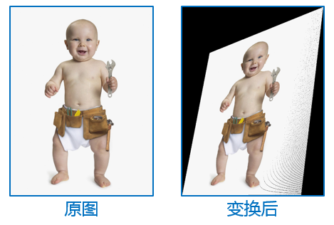
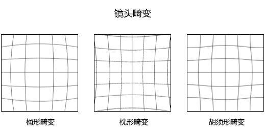

# 什么是 “3D 几何学”

## 内容定位

说到几何学，就不可避免地需要谈到数学，因为 “几何” 这个词给大多数人的第一感觉无非就是在一张白纸或者黑板上横七竖八躺着的三角形、圆、平行四边形，以及在它们之上画得一团乱麻的辅助线和符号。

尽管如此，专门学习和研究数学的那些人——在今天几乎指的就是数学专业的那些人——可能会对此有一定的异议，他们可能会用一大堆晦涩难懂的符号告诉你数学的宏大高深绝不是仅依赖那种传统的直观的、可视化的方法和手段就足以描述的，最后附上一个高冷的 Q.E.D 作为结尾。

因此，笔者在起名字的时候，着实头疼了一会儿，因为不知道接下来的这一系列博文所写的内容应该分到哪个学科，以及学科的哪个分支之下。

它属于数学吗？好像沾一点边，但是这个理由好像有点牵强（不禁令人想起某一小部分因为见到他们本科课程中有一门 “C 语言”，就觉得自己的专业是 “高贵” 的计算机专业的自以为是的人），数学里面 “几何” 一词的确涵盖了下属的许多分支——解析几何、微分几何、代数几何……它们中的任何一门都有着极高的难度，与之相比，本文的内容实在是太浅显、太简单了、太 “古典” 了。归类为数学，的确有点不太恰当，搞不好还会引起（如本节第二段所述）那群智力水平极高的人中一部分人的反感。

它属于计算机科学吗，好像也沾点边——因为这些内容的出发点和最终应用面就是计算机图形学、数字图像处理等这些领域，但是后者的内容又远远不止于本文专注的这些内容；而且，本文（以及接下来一系列的内容）讨论的是抽象的理论和公式，甚至可以完全脱离具体的代码以及在计算设备上的实现，因此把它归结到计算机科学，感觉还是勉强可以接受的——请注意，“勉强” 接受。

## 一些具体的例子

笔者在读徐明老师的 《符号逻辑讲义》的时候，曾读到一段很受启发的话：

> 像 “逻辑是什么” 或者 “当代逻辑是什么” 这类问题，如果问的是逻辑或者当代逻辑的定义，那么我劝初学者不要太认真。初学逻辑，自然想知道逻辑学大概是怎么回事，想知道逻辑学家大概做些什么。但是，若想满足这种好奇心，与其在脑子里装些不明不白的 “定义”，不如对逻辑学讨论的问题以及讨论的方法多一些认真。这是因为：对一个学科整体上的理解，是对该学科中的问题和方法的理解为前提的。

> 如果我们去上物理课或者数学课，或是去读一篇数学论文或者物理论文，老师或者作者会在那里大谈数学是什么或者物理是什么吗？不会，至少通常不会。相反，他们会讨论一些具体的数学或者物理问题，会告诉我们如何解决这些问题，也会讨论一些理论，会告诉我们这些理论如何解决若干问题。

笔者深以为然，因此，我们也不要纠结这些 “3D几何学” 具体应该划分到哪个学科了，来看看具体的例子会更好一些。

1. 图像 / 图形的放大与缩小

    在图像处理、计算机图形学中，我们常常遇到的一个问题是：需要对一幅图像或者一个图形文件中的对象或者区域进行尺寸放大或者缩小，如下图所示：

    

    在计算机上我们应该如何实现这一功能呢？这就是我们需要考虑的问题。千万不要抬杠说：“很简单呀！我只需要打开 Photoshop 这类软件，鼠标点几下就可以啦” 某种意义上说，这个答案的确也不能说是 “错误” 的，但是进一步地追问下去，从算法、程序设计的角度讨论，这些软件的内部是采用了什么方法以达到这样的效果呢？

1. 透视变换

    下图中的左半侧图像是一个婴儿的照片，在视角上是从正面垂直对着婴儿身体的正面拍摄的；而右半侧的图片像是以一个倾斜的视角拍摄的，由于成像时的 “近大远小” 导致照片被局部拉伸局部压缩成了颇为奇怪的视觉效果。

    

    要实现从左图到右图的变换，固然可以在现实世界采集图像的时候调整拍摄的角度和位置，但是如果需要在计算机上实现这种变换效果，应该如何做呢？

2. 球极投影

    

    如上图所示，网格线实际上都是平行的，而在上图的三幅子图中，我们可以非常清楚地看见，网格线发生了整体的畸变，从而使得平行的网格线发生了不同类型的 “扭曲”

    问题又来了，我们应该如何构造算法，并根据算法来编写程序，来把正常的平行网格变换成上图的效果，或者反过来，从以上的畸变效果图恢复网格原来横平竖直的样子呢？

综上，这些问题都是在图像处理或者计算机图形学中经常会遇到的问题，它们有一个共同的特点，就是在**变换前后发生的都是几何变化，伴随着像素点在空间位置上的改变**，或者简短一点来讲：**以上都是几何变换**

在此试着列举一个图像处理中不是几何变换的例子：

如上图所示，这是著名的高斯模糊的例子，这和我们之前列举的三个例子在算法的思路、所需的知识背景上是有一定区别的。不妨直观地感受一下。

## 总结

笔者的 “3D 几何学” 系列，如果硬要下一个定义或者概念界定的话，或许可以这么说：

<b>在计算机图形学、数字图像处理等方向中所涉及到的几何变换背后的几何基础</b>

这么一总结，不禁令人想起了 CS 的 “数据结构” 或者 EE 的 “信号与系统” 这类理论性较强的课程。

# 所需要的前置知识和技能

1. 保持思考的大脑

2. 初等平面几何

3. 初等立体几何

4. 线性代数（重要）

5. 基本的计算机图像常识

6. 任何一门编程语言（最好）