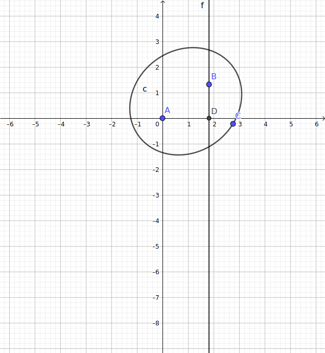

# Markdown Preview Enhanced 功能测试

author：陈志伟

**说明：此文档用于列举最新的 Markdown Preview Enhanced 的支持功能，同时也可以用于测试某个平台上的 MPE 是否正常工作**

markdown 基本语法测试


# 测试：一级标题 {#label}

## 测试：二级标题

### 测试：三级标题

#### 测试：四级标题

##### 测试：五级标题

###### 测试：六级标题

####### 测试：七级标题（MPE markdown 只支持到六级标题，此行为正文）

测试：Setext形式的标题：一级标题
==

测试：Setext形式的标题：二级标题（这种形式只支持两级标题）
--

换行测试1  
可以在源文件中的一行后面空两格，然后回车换行  
这种换行方式是贴紧换行，或者称段内换行

换行测试2  
也可以在一行后面使用连续两个回车换行，也即两行之间留有至少一个空行

这样的显示效果就是留空换行，实际上已经是两个段落

测试强调效果：
*这会是 斜体 的文字*
_这会是 斜体 的文字_

**这会是 粗体 的文字**
__这会是 粗体 的文字__

_你也 **组合** 这些符号_

~~这个文字将会被横线删除~~

>测试：引用块

> 测试：如果一行是引用，那么
后面与其相邻的行也是引用
可以如此递推

>如果引用内容需要换行，
>可以在行尾添加两个空格
>
>或者在引用内容中加一个空行

>也可以在引用中
>>使用嵌套的引用
>>> 继续……
>>>> 一直继续……
>>>>> 再一直继续……

>在引用中可以使用使用其他任何 *Markdown* 语法，比如： $f=ma$

* 测试-无序列表：可以使用 `*` 作为标记
+ 测试-无序列表：也可以使用 `+`
- 测试-无序列表：或者 `-`

1. 有序列表以数字和 `.` 开始；
3. 数字的序列并不会影响生成的列表序列；
4. 但仍然推荐按照自然顺序（1.2.3...）编写。

05\. 可以使用：数字\. 来取消显示为列表

3.注意，有序列表的 '.' 后面要空一格，否则不会被认为是列表，而是一般的正文（这就是反面例子）

1. 第一层

    + 1-1
    + 1-2
2. 无序列表和有序列表可以随意相互嵌套

    1. 2-1
    2. 2-2

测试定义型列表
:    （左侧有一个可见的冒号和四个不可见的空格）


```
testing code segment
#include <iostream>
```

行内代码测试 `inline code segment`

分割线测试（三种异曲同工的写法）
***
分割内容1

---
分割内容2

___


测试超链接-行内式：

普通链接测试
[傻逼百度](https://www.baidu.com)

本地文件链接
[本地文件](./test.txt)

试试绝对链接
[试一试](assets/pp.svg)

包含标题的链接（鼠标悬停会显现）
[傻逼百度](https://www.baidu.com "baidu")

测试超链接-参考式：
[傻逼百度][123]


[123]: https://www.baidu.com "这是真正定义链接内容的地方"
如果某一个链接在文章中多处使用，那么使用引用 的方式创建链接将非常好，它可以让你对链接进行统一的管理。

测试自动链接：
<https://www.baidu.com/>

测试锚点（页内超链接）：
[本文第一个标题](#label)

测试图像插入： 

图像行内式插入：


插入 svg：




svg 动画：


图像参考式插入：

![GitHub][github]

[github]: https://avatars2.githubusercontent.com/u/3265208?v=3&s=100 "图像的源地址也可以网络链接"


也可以插入动态图：


试试图像居中


插入动态 webp：


测试目录：
[TOC]

另一种更为精细的目录生成方法（保存时自动生成，还可以手动调节选项）
<!-- @import "[TOC]" {cmd="toc" depthFrom=1 depthTo=5 orderedList=true} -->

<!-- code_chunk_output -->

1. [ Markdown Preview Enhanced 功能测试](#markdown-preview-enhanced-功能测试)
2. [ 测试：一级标题](#label)
    1. [ 测试：二级标题](#测试二级标题)
        1. [ 测试：三级标题](#测试三级标题)
            1. [ 测试：四级标题](#测试四级标题)
                1. [ 测试：五级标题](#测试五级标题)

<!-- /code_chunk_output -->


测试脚注：
使用 Markdown[^1]可以效率的书写文档, 直接转换成 HTML[^2], 你可以使用 Leanote[^Le] 编辑器进行书写。

[^1]:Markdown是一种纯文本标记语言

[^2]:HyperText Markup Language 超文本标记语言

[^Le]:开源笔记平台，支持Markdown和笔记直接发为博文


测试数学公式渲染：
行内公式：
$\sum_{i=0}^{\mathcal{B}} i^2 = \frac{(n^2+n)(2n+1)}{6}=\binom{n+1}{3}+\binom{n+1}{2}$

\(\sum_{i=0}^\mathbb{A} i^2 \neq \frac{(n^2+n)(2n+1)}{6}=\binom{n+1}{3}+\binom{n+1}{2}\)

行间公式：
$$
\begin{align}
\sqrt{37} & = \sqrt{\frac{73^2-1}{12^2}} \\
 & = \sqrt{\frac{73^2}{12^2}\cdot\frac{73^2-1}{73^2}} \\ 
 & = \sqrt{\frac{73^2}{12^2}}\sqrt{\frac{73^2-1}{73^2}} \\
 & = \frac{73}{12}\sqrt{1 - \frac{1}{73^2}} \\ 
 & \approx \frac{73}{12}\left(1 - \frac{1}{2\cdot73^2}\right)
\end{align}
$$

\[
\begin{align}
\sqrt{37} & \neq \sqrt{\frac{73^2-1}{12^2}} \\
 & = \sqrt{\frac{73^2}{12^2}\cdot\frac{73^2-1}{73^2}} \\ 
 & = \sqrt{\frac{73^2}{12^2}}\sqrt{\frac{73^2-1}{73^2}} \\
 & = \frac{73}{12}\sqrt{1 - \frac{1}{73^2}} \\ 
 & \approx \frac{73}{12}\left(1 - \frac{1}{2\cdot73^2}\right)
\end{align}
\]

测试表格
| left | center | right |
| :--- | :----: | ----: |
| aaaa | bbbbbb | ccccc |
| a    | b      | c     |

测试任务列表
- [x] @mentions, #refs, [links](), **formatting**, and <del>tags</del> supported
- [x] list syntax required (any unordered or ordered list supported)
- [x] this is a complete item
- [ ] this is an incomplete item

扩展语法测试：Emoji & Font-Awesome（只适用于 markdown-it parser）
:smile:
:fa-car:

扩展语法测试：上标
30^th^

扩展语法测试：下标
H~2~O

扩展语法测试：缩略
*[HTML]: Hyper Text Markup Language
*[W3C]:  World Wide Web Consortium
The HTML specification is maintained by the W3C.

扩展语法测试：高亮标记
==marked==


扩展语法测试：CriticMarkup（只能用于markdown-it parser）

Don't go around saying{-- to people that--} the world owes you a living. The world owes you nothing. It was here first. {~~One~>Only one~~} thing is impossible for God: To find {++any++} sense in any copyright law on the planet. {==Truth is stranger than fiction==}{>>strange but true<<}, but it is because Fiction is obliged to stick to possibilities; Truth isn’t.

---
图形渲染测试：
1\. **flowchart**

```flow{align=center}
//结构模块
st=>start: 开始
e=>end: 结束
op=>operation: 我的操作
cond=>condition: 确认？

//流程模块
st->op->cond
cond(yes)->e
cond(no)->op
```


2\. **Sequence Diagrams**

```sequence
Title: Indirect Pathway
SNc->Str: DA(preset)
Cx->Str: Glu
Str-->GPe: GABA
GPe-->GPi/SNr: GABA
GPi/SNr-->Thalamus: GABA
Thalamus->Cx: Glu
``` 


3\. **Mermaid**


4\. **PlantUML**（需要预安装 Java）


5\. **WaveDrom**
```wavedrom
{ signal: [ 
  {    name: 'clk',   wave: 'p..Pp..P'}, 
  ['Master', 
    ['ctrl', 
      {name: 'write', wave: '01.0....'}, 
      {name: 'read',  wave: '0...1..0'} 
    ], 
    {  name: 'addr',  wave: 'x3.x4..x', data: 'A1 A2'}, 
    {  name: 'wdata', wave: 'x3.x....', data: 'D1'   }, 
  ], 
  {}, 
  ['Slave', 
    ['ctrl', 
      {name: 'ack',   wave: 'x01x0.1x'}, 
    ], 
    {  name: 'rdata', wave: 'x.....4x', data: 'Q2'}, 
  ] 
]} 
```


6\. **GraphViz**
```viz
digraph g {
  node[shape=record,height=.1]; //定义了下面的node样式

  node0[label="<f0> |<f1> A|<f2> "]; //我是一个node, 我有三个属性, 第二个属性名字为A, 其他两个为空
  node1[label="<f0> |<f1> B|<f2> "];
  node2[label="<f0> |<f1> C|<f2> "];
  node3[label="<f0> |<f1> D|<f2> "];
  node4[label="<f0> |<f1> E|<f2> "];
  node5[label="<f0> |<f1> F|<f2> "];
  node6[label="<f0> |<f1> H|<f2> "];
  node7[label="<f0> |<f1> I|<f2> "];
  node8[label="<f0> |<f1> J|<f2> "];
  node9[label="<f0> |<f1> K|<f2> "];

  "node0":f2 -> "node1": f1; //node0的第三个属性连到node1的第二个属性
  "node1":f0 -> "node2": f1;
  "node1":f1 -> "node3": f2;
  "node3":f0 -> "node4": f0;
  "node3":f1 -> "node5": f1;
  "node3":f2 -> "node6": f2;
  "node6":f1 -> "node7": f1;
  "node7":f1 -> "node8": f0;
  "node2":f2 -> "node9": f1;
}
```


7\. **Vega 和 Vega-lite**
```vega-lite
{
  "$schema": "https://vega.github.io/schema/vega-lite/v3.json",
  "description": "A simple bar chart with embedded data.",
  "data": {
    "values": [
      {"a": "A","b": 28}, {"a": "B","b": 55}, {"a": "C","b": 43},
      {"a": "D","b": 91}, {"a": "E","b": 81}, {"a": "F","b": 53},
      {"a": "G","b": 19}, {"a": "H","b": 87}, {"a": "I","b": 52}
    ]
  },
  "mark": "bar",
  "encoding": {
    "x": {"field": "a", "type": "ordinal"},
    "y": {"field": "b", "type": "quantitative"}
  }
}
```


8\. **Ditaa**（需要预安装 Java）
```ditaa {cmd=true args=["-E"]}
+--------+   +-------+    +-------+
|        | --+ ditaa +--> |       |
|  Text  |   +-------+    |diagram|
|Document|   |!magic!|    |       |
|     {d}|   |       |    |       |
+---+----+   +-------+    +-------+
    :                         ^
    |       Lots of work      |
    +-------------------------+
```

---

导入文件测试
@import "test.txt"

@import "pic.png"{width="400px" height="250px" title="图片的标题" alt="我的 alt"}

---

Code Chunk 功能测试：
**此功能有一定安全隐患，默认不开启**

---

Pandoc 支持

Markdown Preview Enhanced 支持类似于 RStudio Markdown 的 pandoc 文档导出特性。

此外，默认情况下， Markdown Preview Enhanced 使用 markdown-it 来转换 markdown。
也可以在插件设置中设置使用 Pandoc Parser 来转换 markdown。 