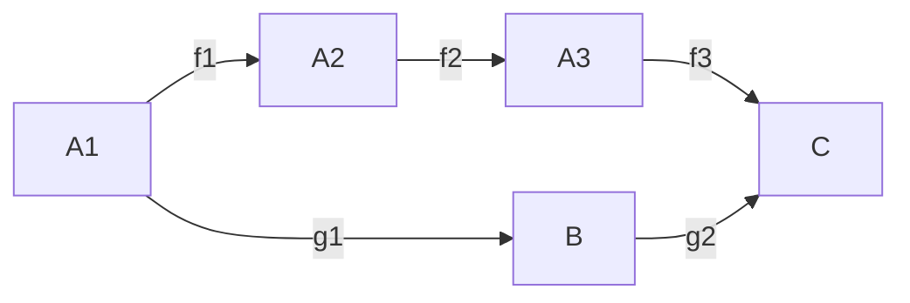
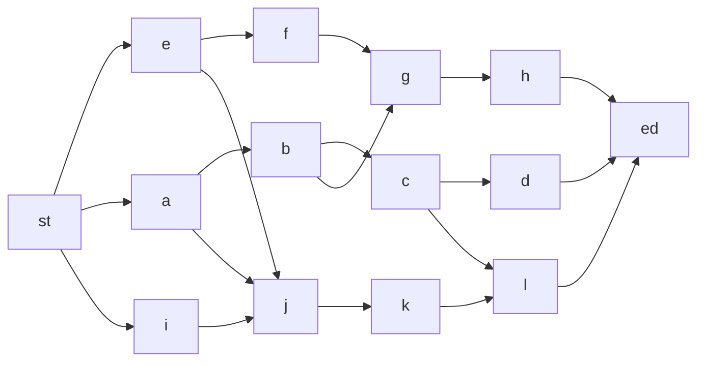
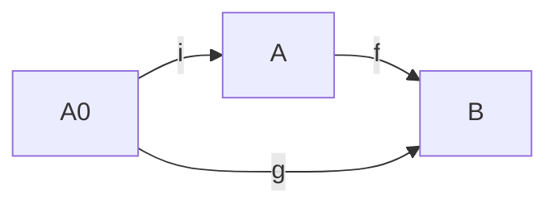

抽代第一篇笔记

<!-- more -->

### Chapter0 铺垫

#### 学习抽代需要注意的一些事情

$ab=ba$ 交换律在实数系中是显然的，但是在抽代中有很多对象并不满足交换律，甚至严格来说，交换律并不是一般成立的；

$(ab)c=a(bc)$ 结合律也不一定成立，比如涉及到非结合代数的时候；

定义不要死记硬背，要理解定义，光背诵是没有用的；

学习过程中，要积累足够的例子，不要空泛地对着定义的描述空想；

#### 教材与参考书

1. 教材：
    1. 《简明抽象代数》顾沛，邓少强，高等教育出版社，2003 版+ 多项式理论
    2. 第二学期：《代数学基础》孟道骥，2010版
2. 参考书：  
    1. N. Jacobson \<Basic Algebra\> Volumn 1,2,3  
    2. M.Artin \<Algebra\>

#### 抽象代数的历史

研究历史的起源：**代数方程的解**  
比如小学的一元一次方程：
$$
ax+b=0
$$
继续下去就是一元二次方程：
$$
ax^2+bx+c=0
$$
存在根式解；

进而，16、17世纪的研究结果表明，三次、四次方程也是存在根式解的. 

问题来了：五次以及五次以上方程的根式解是否存在？

### Chapter1 群

#### Section1 运算与关系（一）

##### Def 0 代数体系

其实就是：（非空）集合 + 运算

抽象代数研究的对象，就是各种各样的代数体系

**注：**空集过于平凡，因此我们在讨论代数体系的时候，**不包括空集**，但这并不代表它不重要或者不会出现；

**邓老师：默认我们非常清楚集合、映射的概念**

下面讲解一些与映射相关的基础概念.

##### Def 1.1.1 嵌入映射

设 $A_0$ 是 $A$ 的子集，定义 $A_0$ 到 $A$ 的映射 $i:A_0 \rightarrow A$ 使得 $i(x)=x,x \in A_0$，称 $i$ 为 $A_0$ 到 $A$ 的嵌入映射

##### Def 1.1.2 开拓与限制

设 $A_0$ 是 $A$ 的子集，$f$ 是 $A$ 到 $B$ 的映射，$g$ 是 $A_0$ 到 $B$ 的映射，若 $f(x)=g(x)$ 对于 $x \in  A_0$ 恒成立，那么称 **$f$ 是 $g$ 的开拓，$g$ 是 $f$ 在 $A_0$ 上的限制**——记作 $g=f|_{A_0}$

下面引入例子介绍一个重要概念：交换图

假设我们有如下映射：
$$
f_1:A_1 \rightarrow A_2 \\
f_2:A_2 \rightarrow A_2 \\
f_3:A_3 \rightarrow C
$$
它们的复合映射为
$$
f_3f_2f_1:A_1 \rightarrow C
$$
另外，我们有映射：
$$
g_1:A_1 \rightarrow B \\
g_2:B \rightarrow C
$$
其复合映射为：
$$
g_2g_1:A_1 \rightarrow C
$$
在此基础上，我们可以有交换图：

 

交换图有个好处，就是当这种映射关系极为复杂的时候，它比使用等式更简单，比如下图

##### 例1

设 $A_0$ , $A$ , $B$ 如定义 1.1.2，$f$ 为 $g$ 的开拓，我们有交换图：

下面来讲解集合

##### 定义1.1.3 直积

设 $A_1$ , $A_2$ 为两个集合，令 $A_1 \times A_2 = \{ (a,b)| a \in A_1, b \in A_2\}$，称 $A_1 \times A_2$ 为 $A_1$ 与 $A_2$ 的直积. 

**注 1**：注意定义是有顺序的

**注 2**：可以很容易就推广到 $n$ 个集合的直积

接下来讲解的是运算

邓老：运算的本质就是
$$
\text{两个元素} \xrightarrow{\text{某种规则}} \text{一个元素}
$$

##### 定义1.1.4 代数运算

设 $A$ , $B$ , $D$ 是非空集合，有映射 $f:A \times B \rightarrow D$ ，则此映射称为 $A$ 与 $B$ 到 $D$ 的一个代数运算.

##### 例2

设 $\mathbb{V}$ 是线性空间，数域为 $\mathbb{P}$ ，则

$\mathbb{V}$ 中的加法确定一个代数运算：$\mathbb{V} \times \mathbb{V} \rightarrow \mathbb{V}$

$\mathbb{P}$ 与 $\mathbb{V}$ 的数乘确定一个代数运算：$\mathbb{P} \times \mathbb{V} \rightarrow \mathbb{V}$

##### 例3

设 $\mathbb{P}$ 是数域，则 $\mathbb{P}^{n\times n}$ 是 $\mathbb{P}$ 上 $n$ 阶方阵的集合

那么矩阵加法、矩阵乘法都是 $\mathbb{P}^{n\times n} \times \mathbb{P}^{n\times n}$ 到 $\mathbb{P}^{n\times n}$ 的代数运算

##### 约定1 二元运算

若在 定义1.1.4 中，集合 $A$ , $B$ , $D$ 相同，则称 $f$ 是 $A$ 上的二元运算

注：此处的约定已经隐式地包含了 “封闭性” 这一性质

##### 约定2 运算简写

一般把 运算 $f(a,b)$ 写成 $a \cdot b$ 或者 $ab$ ，有时也会使用符号 $+$ 或者 $\times$ ，并用括号来表示优先级：$d((ab)c)$ 

因为写成传统的映射形式过于冗长……

接下来讲解一下运算规律：

##### 定义1.1.5 交换律

设 $A$ 上定义了二元运算，且 $ab=ba$ 对于一切 $a,b \in A$ 恒成立，则称该运算满足交换律

##### 定义1.1.6 结合律

设 $A$ 上定义了二元运算，且 $(ab)c=a(bc)$ 对于一切 $a,b,c \in A$ 恒成立，则称该运算满足结合律

##### 定义1.1.7 分配律

设 $A$ 上定义了两种二元运算 $+$ 和 $\cdot$ 并有 $a\cdot (b+c) = a \cdot b +a \cdot c$ 对于一切 $a,b,c \in A$ 恒成立，则称运算 $\cdot$ 满足对运算 $+$ 的**左分配律**；

右分配律可以类似地定义；

若同时满足左、右分配律，则称一种运算对另一种运算满足**分配律**

##### 关于运算规律的一些注解

设 $A$ 上定义了代数运算，且运算满足结合律，则对于一切 $n \in N^+$，$a^n$ 是有意义的；

进而，如果还满足交换律，则 $(ab)^n=a^nb^n$ 是成立的；

##### 定义1.1.8 运算表

设运算 $f:A \times B \rightarrow D$ ，且 $A$ 和 $B$ 都是有限集

那么运算表就是将 $A$ 和 $B$ 的元素像数据结构中的邻接矩阵那样一横一纵地列出，并填上每对元素的运算结果。

——其实，就跟邻接矩阵几乎没有任何区别……

##### 例6

设 $A=\{1,2\},B=\{1,2\},D=\{奇，偶\}$，其运算用运算表的形式表示就是：

| f    | 1    | 2    |
| ---- | ---- | ---- |
| 1    | 奇   | 偶   |
| 2    | 偶   | 奇   |

##### 定义1.1.9 关系

设 $A$ 是非空集合，则 $A$ 上的一个**关系**是 $A\times A$ 的一个子集 $R$ ；

对于一切 $a,b \in A$，$a\, R\, b$ 当当且仅当有序对 $(a,b) \in R$ 

##### 定义1.1.10 等价关系

设非空集合 $A$ 上定义了关系 $R$ ，若 $R$ 满足条件：

1. 反身性：$\forall a \in A,a\, R\, a$
2. 对称性：$a\, R\, b \rightarrow b\, R\,a$
3. 传递性：$a\, R\, b,\ b\, R\, c \rightarrow a\, R\, c$

则称 $R$ 是定义在 $A$ 上的一个等价关系

##### 例7

定义在实数集 $\mathbb{R}$ 上的序关系 $\leq$ 不是等价关系

##### 例8

$\mathbb{P}^{n \times n}$ 上的相似关系是等价关系

##### 定义1.1.11 分划/划分/分类

设 $A$ 是非空集合，$A$ 的一个分划是指一个 $A$ 的子集的集合，且满足：对于一切的 $a\in A$，$a$ 恰包含于 $A$ 的一个子集中

**注解**：直观地说， $A$ 的一个分划就是将 $A$ 写成一些不相交的非空子集的并，即：
$$
A=\bigcup_{i \in I}A_i \\
\text{where} \quad \forall i \in I\ ,A_i \neq \varnothing \quad \text{and} \quad \forall i,j \in I,i \neq j \rightarrow A_i \cap A_j = \varnothing
$$
最终这些 $A_i$ 构成的集合 $\{A_i\}$ 就是 $A$ 的分划

##### 定理1.1.1

$A$ 的一个分划决定了 $A$ 上的一个等价关系.

*Proof*

设 $A=\bigcup_{i \in I}A_i$，且 $A_i \neq \varnothing$ ，$A_i \cap A_j = \varnothing$ 对于一切 $i\neq j$ 成立.

定义关系 $R$ : $a\, R\, b$ 当且仅当： $\exists i \in I,\ a,b \in A_i$

再验证 $R$ 满足等价关系的三个性质.

 Q.E.D.

既然，集合的分划直接确定其上的等价关系，那么反过来是否仍然成立呢？先介绍几个概念，我们后面将会知晓. 

##### 定义1.1.12 等价类

设 $A$ 非空，且 $A$ 中有一个等价关系 $R$ ，设 $a\in A$，定义 $a$ 的等价类为 $\overline{a}=\{b \in A\ |\ a\, R \, b\}$，或记作 $[a]$

##### 定义1.1.13 商集

设 $A$ 非空，且 $A$ 中有一个等价关系 $R$ ，定义集合 $A/R=\{\overline{a}\ |\ a \in A\}$ 为 $A$ 对于 $R$ 的商集. 

**注解**：注意，在 $A$ 中可能存在两个不同的元素 $a_1$ 和 $a_2$ ，其等价类都是 $\overline{a}$ ，在这种重复出现的情况下，商集当然只取一次.

##### 定义1.1.14 自然映射

定义映射 $\pi :A \rightarrow A/R$，满足 $\pi(a)=\overline{a}$ ，称之为 $A$ 到 $A/R$ 的自然映射

##### 定理1.1.2

$A$ 中的一个等价关系 $R$ 决定了 $A$ 的一个分划.

证略.

##### 定义1.1.15 同余关系

设集合 $A$ 非空，$A$ 中定义了二元运算 $\cdot$ 和等价关系 $R$，如果 $R$ 和 $\cdot$ 满足：
$$
a_1\,R\,b_1,\ a_2\,R\,b_2 \rightarrow (a_1 \cdot a_2)\,R\,(b_1,b_2)
$$
则称 $R$ 是对 $\cdot$ 的同余关系.

##### 构造新的代数体系

正如我们知道的，所谓代数体系，就是 “集合+运算”，那么我们由原来的代数体系构造成一个新的代数体系，所需要做的无非就是构造新的集合，再定义新的运算. 现在我们就是构造之.

设 $R$ 是 $A$ 中对于 $\cdot$ 的同余关系，我们有
$$
(A,\cdot)\xrightarrow{新的代数体系}(A/R,\overline{\cdot})
$$
其中 $A/R$ 是 $A$ 的商集，而新运算 $\overline{\cdot}$ 定义如下：
$$
\forall\ \overline{a},\overline{b} \in A/R,\ \overline{a} \overline{\cdot}\overline{b}:=\overline{a \cdot b}
$$

还记得实数理论吗？定义新的运算之后，我们要说明新的运算是良定义的：

假设 $a,c \in A$，且 $\overline{a} =\overline{c}$，那么 $\overline{a} \overline{\cdot}\overline{b}:=\overline{a \cdot b}$ 且 $\overline{c} \overline{\cdot}\overline{b}:=\overline{c \cdot b}$，注意到 $R$ 是 $A$ 中对于 $\cdot$ 的同余关系，所以 $(a\cdot b)\,R\,(c\cdot b)$，于是 $\overline{a\cdot b}=\overline{c\cdot b}$ 成立，于是新的运算是良定义的.

—— “$R$ 是 $A$ 中对于 $\cdot$ 的同余关系” 这一条件是必不可少的！

##### 例9

设 $\mathbb{Z}$ 中取 $m>0$，定义关系 $R$ 满足 $a\,R\,b$ 当且仅当 $m|(b-a)$，显然 $R$ 是等价关系，而 $\mathbb{Z}$ 中有 $+$ 和 $\cdot$ 运算， $R$ 是它们的同余关系.

注解：顾名思义，抽代中的同余关系的名称其实就是从数论中的同余关系 “延拓” 而来的；

##### 例10

定义 $\mathbb{P}^{n \times n}$ 上的关系 $R$，$ARB$ 当且仅当 $\mathrm{det}(A) =\mathrm{det}(B)$；$R$ 是 $\mathbb{P}^{n \times n}$ 上的等价关系；

而 $R$ 对于 $\mathbb{P}^{n \times n}$ 上的加法不是同余关系；

 $R$ 对于 $\mathbb{P}^{n \times n}$ 上的矩阵乘法是同余关系.

